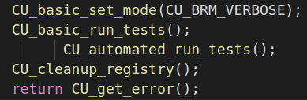
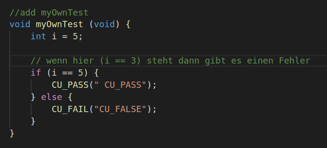
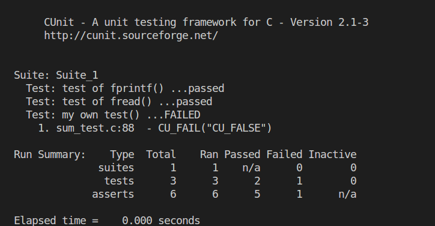

#  

## Table of Contents

  - [Framework C-Unit](#framework-c-unit)
  - [Schritte](#schritte)
  - [Links](#links)
  - [Code](#code)
  - [Vorgehen](#vorgehen)
  - [Explain](#explain)
  - [Done](#done)


### Framework C-Unit
```bash
http://cunit.sourceforge.net/
```
## Schritte

1. Download (https://sourceforge.net/projects/cunit/);
2. Einarbeitung in das Vorgehen
http://cunit.sourceforge.net/doc/introduction.html
# Links
- http://home.edvsz.fh-osnabrueck.de/skleuker/CSI/Werkzeuge/C/CUnit.html
- http://manpages.ubuntu.com/manpages/xenial/man3/CUnit.3.html
- http://people.cs.aau.dk/~bnielsen/TOV07/lektioner/cunit-intro-07.pdf (PowerPoint)
- http://retis.sssup.it/~marco/files/lesson16_unit_test_cunit_cmockery.pdf

# Code

First: 
CU_initialize_registry(void) 
    -> CUE_SUCCESS      oder
    -> CUE_NOMEMORY

Last: 
void CU_cleanup_registry(void)
    -> Gibt den Speicher wieder frei


## Vorgehen
#include "CUnit/Basic.h" </br>
_>Als Suitname wurde hier pSuite genommen

int init_suite(void)
{return 0;}

int clean_suite(void)
{return 0;}


- int main(){</br>
    CU_pSuite pSuite = NULL; </br>

     / Das CUnit test registry initalisieren /</br>
   if (CUE_SUCCESS != CU_initialize_registry())</br>
      return CU_get_error();</br>

    / Die Suite zum registry hinzufügen /   </br>
    pSuite = CU_add_suite("Suite_1", init_suite1, clean_suite1);  </br>
   if (NULL == pSuite) {</br>
      CU_cleanup_registry();</br>
      return CU_get_error();</br>
   }</br>
</br>
      / Die Tests zur Suite hinzufügen /</br>
   /<b> WICHTIG: Hier muss auf die Reihenfolge geachtet werden </b> /</br>
   if ((NULL == CU_add_test(pSuite, "test of fprintf()", testFPRINTF)) ||</br>
       (NULL == CU_add_test(pSuite, "test of fread()", testFREAD)) ||</br>
       (NULL == CU_add_test(pSuite, "my own test()", myOwnTest)))</br>
   {</br>
      CU_cleanup_registry();</br>
      return CU_get_error();</br>
   }</br>
</br>
   / Tests werden mit dem CUnit Basic Interface gestartet /</br>
   CU_basic_set_mode(CU_BRM_VERBOSE);</br>
   CU_basic_run_tests();</br>
   CU_cleanup_registry();</br>
   return CU_get_error();</br>
}</br>
</br></br>

## Explain

</br>
<b>CU_ASSERT(plus(x,y) == x+y); </b> </br>
Hier als Beispiel: Der "return Wert" der Funktion plus(x,y) muss den gleichen Wert besitzen wie der nach "==" ; </br>

<b>   CU_automated_run_tests(); </b> </b> </br>
Am Ende der Datei Hinzufügen um XML Datei mit Ergebnissen zu erhalten. Siehe <a href="/10.04.2018/CUnitAutomated-Results.xml">Hier<a> 


</br>
<b>CU_ASSERT_PTR_NULL(pointer); </b> </br>
Prüft ob der Wert des Pointers NULL ist </br>
</br>
<b>CU_ASSERT_PTR_EQUAL(front1, rear); </b> </br>
Prüft ob die Werte der Pointer gleich sind </br>


# Done

## Database
<a href="https://github.com/FelixSchubi/C-Test/blob/master/11.04.2018/Database.md">Studentendatenbank</a>  </br>
## Fehler
</br></br>
Ersten Fehler eingebaut:

Resultat ist dann folgendens (Bei   "(i ==3)"  ):

In einem Test hat man immer noch die Möglichkeit etwas über die Konsole abzufragen!

