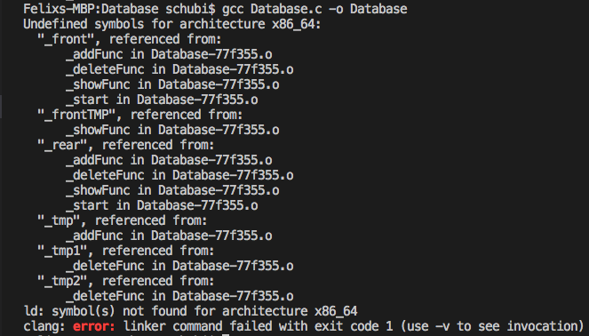

# Ohne Test
Im Moment muss nach jedem mal noch neu compiliert werden, da die create() Funktion nicht geht und dadurch die Pointer nicht auf NULL gesetzt werden und ein Speicherzugriffsfehler entsteht. <br>
Als Standart .c Datei ohne zusätzliche Tests.<br>
<a href="https://github.com/FelixSchubi/C-Test/tree/master/16.04.2018/Database">Hier!<a> <br>

- Bei begin.h durfte die Funktion nicht den gleichen Namen haben wie die Datei?  ??Warum nur hier?? 
- Das "User Interface" funktioniert soweit wieder
- Man kann mehrere Studenten eingeben
- Bei show() wird angezeigt dass die Liste leer ist 
- Bei delete() wird, egal was eingegeben wird, // Segmentation fault:11 // angezeigt
https://books.google.de/books?id=HeVuBAAAQBAJ&pg=PA236&lpg=PA236&dq=c+handle+struct+node+between+different+files&source=bl&ots=CxaGq6hGn6&sig=zwQpPIHKP29G-RXsCRPP3mlWpBg&hl=de&sa=X&ved=0ahUKEwjqmZXH1MDaAhVGJ8AKHUzFBgoQ6AEIRzAD#v=onepage&q=c%20handle%20struct%20node%20between%20different%20files&f=false (Könnte für später nützlich werden..)

// Es wird eine process_node.c erstellt! Es wird versucht nur eine Node zu erstellen, auf welche jeder zugreifen kann.
Fehlermeldung: <br>

  
# Mit Test

Die Funktionen werden hier erneut benutzt; nur diesmal wird das Framework CUnit zum Testen der Funktionen verwendet. <br>
<a href="https://github.com/FelixSchubi/C-Test/tree/master/16.04.2018/DatabaseTest">Hier!<a> <br>
C-Unit for Mac: <a href="http://macappstore.org/cunit/">Download!<a> <br>
Man darf nur eine Art von Test machen ansonsten "Bus error 10"! <br>
Wie man <a href="https://stackoverflow.com/questions/34377423/c-return-struct-pointer/34377872">Pointer<a> zurückgibt (Zum Testen) <br>

  
### Schritte

``` bash
- https://stackoverflow.com/questions/5128664/how-to-split-a-c-program-into-multiple-files <br>
Ist es notwendig drei Dateien zu erstellen? bzw. zwei eine .h & .c ??
```